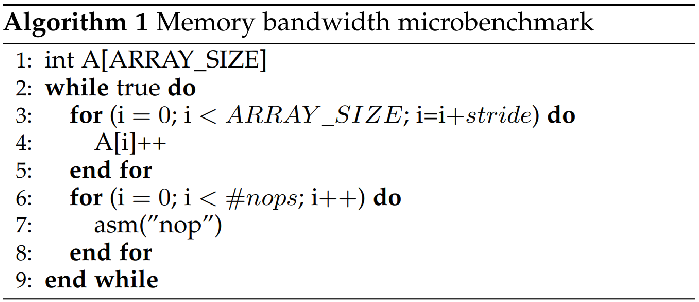

# Microbenchmark: benchmark to saturate memory bandwidth.

## Author

* Manel Lurbe Sempere (malursem@gap.upv.es)

## Compile on GNU/Linux

```
gcc microbench.c -o microbench
```

## Usage

```
Usage: ./microbench iter nop_ops stride core
```

## Notes

- Tested on IBM POWER 8 with Ubuntu 18.04.
- Tested on Intel x86_64 platforms with Ubuntu 20.04.

## Description



Algorithm 1 presents the pseucodode of the microbenchmark. It consists of a main loop (lines 2–9), where a burst of memory requests (lines 3–5) is issued. This burst is followed by a customizable number of NOP operations, which allow us to set the bandwidth consumption of the microbenchmark and study different levels of bandwidth contention.

Memory requests access a memory array defined in line 1. The array size should, at least, double the size of the LLC of the processor to ensure that data is evicted from the cache before it is re-accessed, and the variable stride should also be configured, depending on the memory architecture, to make sure that two consecutive accesses to the array access different cache lines. In this way, we avoid LLC hits, maximizing the memory bandwidth the microbenchmark consumes. We found empirically that the main memory bandwidth saturates when at least three independent instances of the microbenchmark are executed together each one on a different core.
